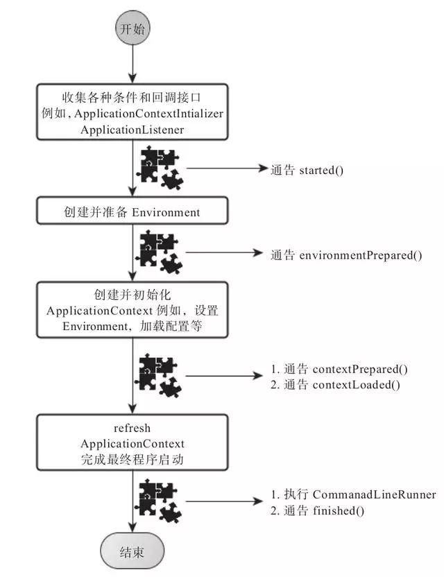

> by Yuanwl

## springboot启动过程分析

### 一、代码分析

从SpringApplication.run()开始：

```java
public static ConfigurableApplicationContext run(Class<?> primarySource, String... args) {
    return run(new Class[]{primarySource}, args); // 调用下面的方法
}

public static ConfigurableApplicationContext run(Class<?>[] primarySources, String[] args) {
    return (new SpringApplication(primarySources)).run(args);
}
```

从这里可以看到首先创建了一个SpringApplication实例，然后在调用的其run()方法。首先我们先去看创建实例这一流程：

```java
// 上面调用的构造方法
public SpringApplication(Class... primarySources) {
    this((ResourceLoader)null, primarySources); // 调用下面的方法
}

// 重构的构造方法，这里面完成了很多初始化工作
public SpringApplication(ResourceLoader resourceLoader, Class... primarySources) {
    this.sources = new LinkedHashSet();
    this.bannerMode = Mode.CONSOLE;
    this.logStartupInfo = true;
    this.addCommandLineProperties = true;
    this.headless = true;
    this.registerShutdownHook = true;
    this.additionalProfiles = new HashSet();
    this.resourceLoader = resourceLoader;
    Assert.notNull(primarySources, "PrimarySources must not be null");
    this.primarySources = new LinkedHashSet(Arrays.asList(primarySources));
    this.webApplicationType = this.deduceWebApplicationType(); // @1
    this.setInitializers(this.getSpringFactoriesInstances(ApplicationContextInitializer.class)); // @2
    this.setListeners(this.getSpringFactoriesInstances(ApplicationListener.class)); //@3
    this.mainApplicationClass = this.deduceMainApplicationClass(); //@4
}
```

针对以上代码关键的流程，我们一一解析：

- @1：这一个方法用于判断当前容器环境：标准spring环境？传统web环境？响应式web环境？然后赋值给 this.webApplicationType （枚举类型），分别对应值 NONE、SERVLET、REACTIVE，后面会用到这个枚举变量，来决定要创建什么样的容器;

- @2：这个方法则是初使化classpath下的所有的可用的ApplicationContextInitializer；

- @3：这个方法则是初使化classpath下的所有的可用的ApplicationListener；

注意看，@2和@3都调用了 getSpringFactoriesInstances 方法；

- @4：最后找出main方法的全类名并返回其实例，然后设置到SpringApplication的this.mainApplicationClass完成初始化；


接下来就是 run 方法的实现了：

```java
public ConfigurableApplicationContext run(String... args) {
    StopWatch stopWatch = new StopWatch();
    stopWatch.start();
    ConfigurableApplicationContext context = null;
    Collection<SpringBootExceptionReporter> exceptionReporters = new ArrayList();
    this.configureHeadlessProperty();

    //@5
    SpringApplicationRunListeners listeners = this.getRunListeners(args);
    listeners.starting();

    Collection exceptionReporters;
    try {
        ApplicationArguments applicationArguments = new DefaultApplicationArguments(args); //@6
        ConfigurableEnvironment environment = this.prepareEnvironment(listeners, applicationArguments); //@7
        this.configureIgnoreBeanInfo(environment);
        Banner printedBanner = this.printBanner(environment); //@8
        context = this.createApplicationContext(); //@9
        exceptionReporters = this.getSpringFactoriesInstances(SpringBootExceptionReporter.class, new Class[]{ConfigurableApplicationContext.class}, context);
        this.prepareContext(context, environment, listeners, applicationArguments, printedBanner); //@10
        this.refreshContext(context); //@11
        this.afterRefresh(context, applicationArguments);
        stopWatch.stop();
        if (this.logStartupInfo) {
            (new StartupInfoLogger(this.mainApplicationClass)).logStarted(this.getApplicationLog(), stopWatch);
        }

        listeners.started(context);
        this.callRunners(context, applicationArguments); //@12
    } catch (Throwable var10) {
        this.handleRunFailure(context, var10, exceptionReporters, listeners);
        throw new IllegalStateException(var10);
    }

    try {
        listeners.running(context);
        return context;
    } catch (Throwable var9) {
        this.handleRunFailure(context, var9, exceptionReporters, (SpringApplicationRunListeners)null);
        throw new IllegalStateException(var9);
    }
}
```

- @5：加载SpringApplicationRunListener对整个容器的初始化过程进行监听；

- @6：获取 SpringApplication.run(Application.class, args) 传入的参数args并初始化为ApplicationArguments对象；

- @7：配置SpringBoot应用的环境；

- @8：打印banner；

- @9：进去这个方法：

```java
protected ConfigurableApplicationContext createApplicationContext() {
    Class<?> contextClass = this.applicationContextClass;
    if (contextClass == null) {
        try {
            switch(this.webApplicationType) {
            case SERVLET:
                contextClass = Class.forName("org.springframework.boot.web.servlet.context.AnnotationConfigServletWebServerApplicationContext");
                break;
            case REACTIVE:
                contextClass = Class.forName("org.springframework.boot.web.reactive.context.AnnotationConfigReactiveWebServerApplicationContext");
                break;
            default:
                contextClass = Class.forName("org.springframework.context.annotation.AnnotationConfigApplicationContext");
            }
        } catch (ClassNotFoundException var3) {
            throw new IllegalStateException("Unable create a default ApplicationContext, please specify an ApplicationContextClass", var3);
        }
    }

    return (ConfigurableApplicationContext)BeanUtils.instantiateClass(contextClass);
}
```

可以看出，正是在这个方法里面，根据之前初始化过程初始化的 this.webApplicationType 来决定初始化一个什么容器。

- @10：准备应用上下文；

- @11：这是实现spring-boot-starter-*的自动化配置的关键，在这里面将配合前文提到的 @EnableAutoConfiguration 注解，一起完成自动化配置；

- @12：启动应用，这里面还会执行 CommandLineRunner；


至此通过SpringBoot启动的容器已经构造完成。这里忽略了启动流程中的收集各种Listener，创建Environment及Environment的初始化的因为这些地方都是SpringBoot提供的各种扩展点。


### 二、图文描述

可能上面的代码分析太枯燥了，那下面就图文结合给大家梳理一遍：

1）如果我们使用的是SpringApplication的静态run方法，那么，这个方法里面首先要创建一个SpringApplication对象实例，然后调用这个创建好的SpringApplication的实例方法。在SpringApplication实例初始化的时候，它会提前做几件事情：

1. 根据classpath里面是否存在某个特征类（org.springframework.web.context.ConfigurableWebApplicationContext）来决定是否应该创建一个为Web应用使用的ApplicationContext类型。
2. 使用SpringFactoriesLoader在应用的classpath中查找并加载所有可用的ApplicationContextInitializer。
3. 使用SpringFactoriesLoader在应用的classpath中查找并加载所有可用的ApplicationListener。
4. 推断并设置main方法的定义类。

2）SpringApplication实例初始化完成并且完成设置后，就开始执行run方法的逻辑了，方法执行伊始，首先遍历执行所有通过SpringFactoriesLoader可以查找到并加载的SpringApplicationRunListener。调用它们的started()方法，告诉这些SpringApplicationRunListener，“嘿，SpringBoot应用要开始执行咯！”。

3）创建并配置当前Spring Boot应用将要使用的Environment（包括配置要使用的PropertySource以及Profile）。

4）遍历调用所有SpringApplicationRunListener的environmentPrepared()的方法，告诉他们：“当前SpringBoot应用使用的Environment准备好了咯！”。

5）如果SpringApplication的showBanner属性被设置为true，则打印banner。

6）根据用户是否明确设置了applicationContextClass类型以及初始化阶段的推断结果，决定该为当前SpringBoot应用创建什么类型的ApplicationContext并创建完成，然后根据条件决定是否添加ShutdownHook，决定是否使用自定义的BeanNameGenerator，决定是否使用自定义的ResourceLoader，当然，最重要的，将之前准备好的Environment设置给创建好的ApplicationContext使用。

7）ApplicationContext创建好之后，SpringApplication会再次借助Spring-FactoriesLoader，查找并加载classpath中所有可用的ApplicationContext-Initializer，然后遍历调用这些ApplicationContextInitializer的initialize（applicationContext）方法来对已经创建好的ApplicationContext进行进一步的处理。

8）遍历调用所有SpringApplicationRunListener的contextPrepared()方法。

9）最核心的一步，将之前通过@EnableAutoConfiguration获取的所有配置以及其他形式的IoC容器配置加载到已经准备完毕的ApplicationContext。

10）遍历调用所有SpringApplicationRunListener的contextLoaded()方法。

11）调用ApplicationContext的refresh()方法，完成IoC容器可用的最后一道工序。

12）查找当前ApplicationContext中是否注册有CommandLineRunner，如果有，则遍历执行它们。

13）正常情况下，遍历执行SpringApplicationRunListener的finished()方法、（如果整个过程出现异常，则依然调用所有SpringApplicationRunListener的finished()方法，只不过这种情况下会将异常信息一并传入处理）

去除事件通知点后，整个流程如下：

