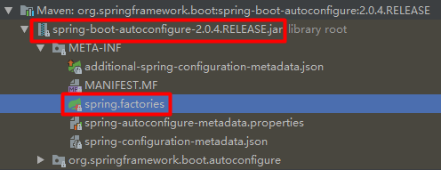
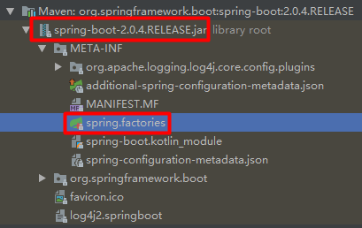
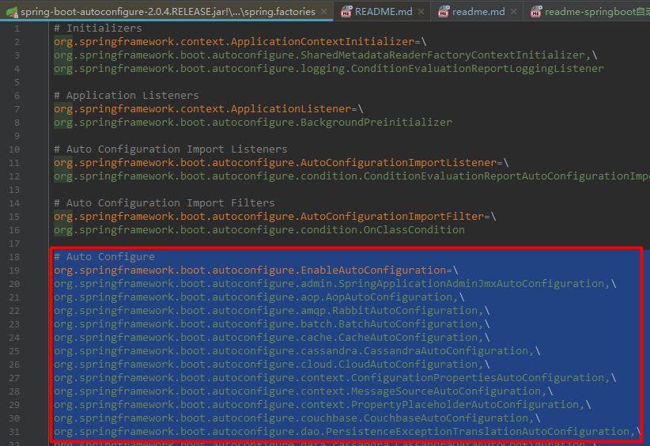
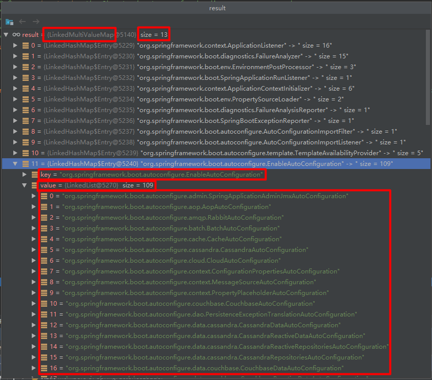

> by Yuanwl

## springboot自动配置原理分析

大家是否还记得Spring框架提供的各种名字为@Enable开头的Annotation定义？比如@EnableScheduling、@EnableCaching、@EnableMBeanExport等，@EnableAutoConfiguration的理念和做事方式其实一脉相承，简单概括一下就是，借助@Import的支持，收集和注册特定场景相关的bean定义：

- @EnableScheduling：通过@Import将Spring调度框架相关的bean定义都加载到IoC容器；
- @EnableMBeanExport：通过@Import将JMX相关的bean定义加载到IoC容器；

而@EnableAutoConfiguration也是借助 @Import 的帮助，将所有符合自动配置条件的bean定义加载到IoC容器，仅此而已！

@EnableAutoConfiguration作为一个复合Annotation，其自身定义关键信息如下：
```java
@Target({ElementType.TYPE})
@Retention(RetentionPolicy.RUNTIME)
@Documented
@Inherited
@AutoConfigurationPackage
@Import({AutoConfigurationImportSelector.class})
public @interface EnableAutoConfiguration {
    String ENABLED_OVERRIDE_PROPERTY = "spring.boot.enableautoconfiguration";

    Class<?>[] exclude() default {};

    String[] excludeName() default {};
}
```

其中，最关键的要属@Import(AutoConfigurationImportSelector.class)，借助AutoConfigurationImportSelector，@EnableAutoConfiguration可以帮助SpringBoot应用将所有符合条件的@Configuration配置都加载到IoC容器，就像一只“八爪鱼”一样。

进入 AutoConfigurationImportSelector ，注意这个方法：
```java
@Override
public String[] selectImports(AnnotationMetadata annotationMetadata) {
    if (!isEnabled(annotationMetadata)) {
        return NO_IMPORTS;
    }
    AutoConfigurationMetadata autoConfigurationMetadata = AutoConfigurationMetadataLoader
            .loadMetadata(this.beanClassLoader);
    AnnotationAttributes attributes = getAttributes(annotationMetadata);
    List<String> configurations = getCandidateConfigurations(annotationMetadata,
            attributes); // 获取所有候选的自动配置类全类名列表
    configurations = removeDuplicates(configurations);
    Set<String> exclusions = getExclusions(annotationMetadata, attributes);
    checkExcludedClasses(configurations, exclusions);
    configurations.removeAll(exclusions);
    configurations = filter(configurations, autoConfigurationMetadata);
    fireAutoConfigurationImportEvents(configurations, exclusions);
    return StringUtils.toStringArray(configurations);
}
```

进入 getCandidateConfigurations 方法：
```java
protected List<String> getCandidateConfigurations(AnnotationMetadata metadata,
            AnnotationAttributes attributes) {
    List<String> configurations = SpringFactoriesLoader.loadFactoryNames(
            getSpringFactoriesLoaderFactoryClass(), getBeanClassLoader()); // 以 getSpringFactoriesLoaderFactoryClass() 的返回值作为key，配合类加载器，把要自动加载的自动配置类全类名找出来
    Assert.notEmpty(configurations,
            "No auto configuration classes found in META-INF/spring.factories. If you "
                    + "are using a custom packaging, make sure that file is correct.");
    return configurations;
}
```

getSpringFactoriesLoaderFactoryClass() 这个方法获取的是什么值？进去看看：
```java
protected Class<?> getSpringFactoriesLoaderFactoryClass() {
    return EnableAutoConfiguration.class; // 返回 @EnableAutoConfiguration 注解的全类名作为key
}
```

进入到 SpringFactoriesLoader.loadFactoryNames 方法：
```java
// 获取目标工厂实现类全类名
public static List<String> loadFactoryNames(Class<?> factoryClass, @Nullable ClassLoader classLoader) {
    String factoryClassName = factoryClass.getName();
    return loadSpringFactories(classLoader).getOrDefault(factoryClassName, Collections.emptyList()); // 调用下面的方法
}

// 获取全部工厂实现类全类名
private static Map<String, List<String>> loadSpringFactories(@Nullable ClassLoader classLoader) {
    // 先从缓存里取
    MultiValueMap<String, String> result = cache.get(classLoader);
    // 如果有值，直接返回
    if (result != null) {
        return result;
    }

    // 如果缓存里没有值（也就是没有调用过本方法），才执行下面的代码@1
    try {
        Enumeration<URL> urls = (classLoader != null ?
                classLoader.getResources(FACTORIES_RESOURCE_LOCATION) :
                ClassLoader.getSystemResources(FACTORIES_RESOURCE_LOCATION));
        result = new LinkedMultiValueMap<>();
        while (urls.hasMoreElements()) {
            URL url = urls.nextElement();
            UrlResource resource = new UrlResource(url);
            Properties properties = PropertiesLoaderUtils.loadProperties(resource);
            for (Map.Entry<?, ?> entry : properties.entrySet()) {
                List<String> factoryClassNames = Arrays.asList(
                        StringUtils.commaDelimitedListToStringArray((String) entry.getValue()));
                result.addAll((String) entry.getKey(), factoryClassNames);
            }
        }
        cache.put(classLoader, result);
        return result;
    }
    catch (IOException ex) {
        throw new IllegalArgumentException("Unable to load factories from location [" +
                FACTORIES_RESOURCE_LOCATION + "]", ex);
    }
}
```

注意上面标注 @1 往后的代码：主要实现的功能是用类加载器读取classpath下常量 FACTORIES_RESOURCE_LOCATION（值是"META-INF/spring.factories"） 指定的所有同名文件（可能不止一个，都是些属性文件），例如：





图一是自动配置对应的jar，图二是springboot的基本jar。截取图一spring.factories文件的部分如下：



loadSpringFactories 这个方法，会把这些文件里的所有属性，整理到一个
```java
Map<String, List<String>>
```

其中key就是上面 spring.factories 文件的某个属性key，比如 org.springframework.boot.autoconfigure.EnableAutoConfiguration ；值则是对应属性值按逗号分隔后组成的List，把所有spring.factories文件里的相同key的值都汇聚到一个List里，最后得到这样的 Map 对象：



debug源码时，你会发现，loadFactoryNames方法会被调用n次，这是因为针对不同的key（也就是工厂接口），有不同的解析工具，每个工具都要遍历一次自己要处理的key对应的List。因为 Map 是放在缓存里的，所以不会有性能问题。

注意上面图3的红框，那些就是 @EnableAutoConfiguration 要初始化的自动配置类，包含了 Redis、MongoDB 等。这里以 org.springframework.boot.autoconfigure.data.mongo.MongoDataAutoConfiguration 为例查看代码如下（这里用的旧版的例子，因为简单，容易说明问题）：

```java
@Configuration
@ConditionalOnClass({MongoClient.class})
@EnableConfigurationProperties({MongoProperties.class}) //开启属性注入。
@ConditionalOnMissingBean(
    type = {"org.springframework.data.mongodb.MongoDbFactory"}
)
public class MongoAutoConfiguration {
    @Autowired
    private MongoProperties properties;
    @Autowired(
        required = false
    )
    private MongoClientOptions options;
    @Autowired
    private Environment environment;
    private MongoClient mongo;
    public MongoAutoConfiguration() {
    }
    @PreDestroy
    public void close() {
        if(this.mongo != null) {
            this.mongo.close();
        }
    }
    @Bean //使用java配置，当容器中没有这个bean的时候执行初始化
    @ConditionalOnMissingBean
    public MongoClient mongo() throws UnknownHostException {
        this.mongo = this.properties.createMongoClient(this.options, this.environment);
        return this.mongo;
    }
}
```

首先这个类被@Configuration注解了，是一个配置类，当下面的条件注解都返回true时 MongoAutoConfiguration 才会被创建为bean并加入到容器中：

- @ConditionalOnClass({MongoClient.class})：当MongoClient在类路径下时返回true，否则false；
- @ConditionalOnMissingBean(
      type = {"org.springframework.data.mongodb.MongoDbFactory"}：当容器中没有 org.springframework.data.mongodb.MongoDbFactory 这种类型bean时，返回true，否则false；

此外，我们可以看一下通过@EnableConfigurationProperties({MongoProperties.class}) 自动注入的属性（这是习惯优于配置的最终落地点）：

```java
@ConfigurationProperties(
    prefix = "spring.data.mongodb"
)
public class MongoProperties {
    public static final int DEFAULT_PORT = 27017;
    private String host;
    private Integer port = null;
    private String uri = "mongodb://localhost/test";
    private String database;
    private String authenticationDatabase;
    private String gridFsDatabase;
    private String username;
    private char[] password;
    private Class<?> fieldNamingStrategy;

    ......
}
```

所以在我们什么都不干的情况下，只需要引入spring-data-mongodb这个依赖再加上默认的MongoDB server我们就能够快速集成MongoDB，用MongodbTemplate访问数据库。

我们可以通过在application.yaml中修改spring.data.mongodb相关的参数就能够修改连接配置，如：
```yaml
spring:
    data:
        mongodb:
            host: localhost
            port: 27017
            username: chingzhu
            password: test123
            database: icekredit
```

利用这套原理，我们也可以轻松地把目前springboot还未集成的、我们自己要使用的第三方技术自动集成起来。

现在，不知道你对springboot的自动配置原理有一个清楚的认识了吗？

看到这里，聪明的你或许应该注意到一个问题了：上面的 @Import(AutoConfigurationImportSelector.class) 只是把 AutoConfigurationImportSelector 创建为一个bean导入springboot容器而已，里面的自动配置逻辑并没有触发，那么，到底在什么时机、哪个地方调用了这些逻辑呢？

要知此事，且听下节分解：[readme-springboot启动过程分析.md](readme-springboot启动过程分析.md)